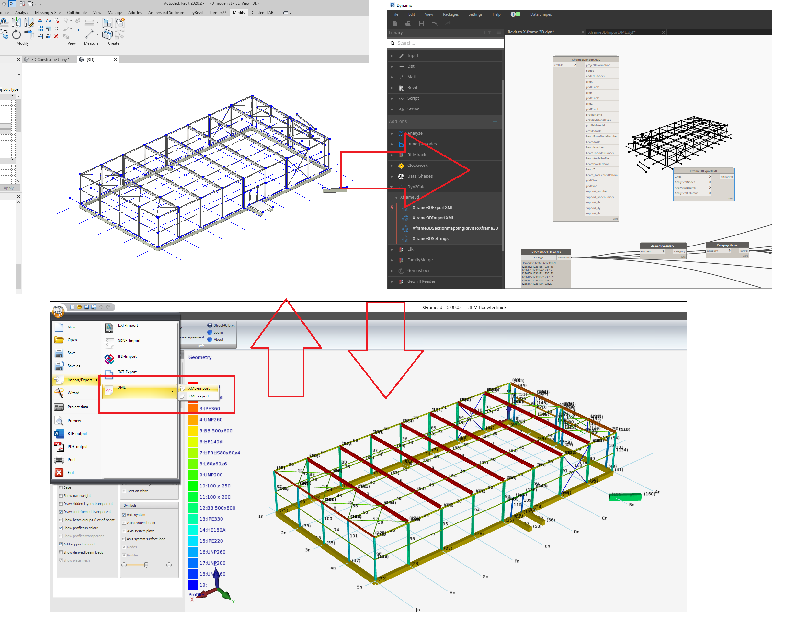

# Dyn2Calc.Struct4U
Library for interoperability between Autodesk Revit,Dynamo and XFEM4U(former Xframe3d)

Xframe3d is a FEM-program for more information check: https://www.struct4u.com/xfem4u/

Export a Revit-model to XFEM4U
Import a Revit-model from XFEM4U

## Version
0.0.1 released on 26-03-2022.(new name)
0.2.2 released on 21-11-2020. Work in progress
0.1.2 released on 28-03-2020. Work in progress

## Installation
Installation is possible via the dynamo built-in package manager.
The name is 'Dyn2Calc.Struct4U'.
Dyn2Calc.XFrame3d' is deprecated on 26-03-2022 due to the namechange of Xframe3D to XFEM4U in 2021.

## Dynamo, Revit-version
The current nodes are tested with Revit 2022 and Dynamo 2.x
It had not been tested with older or newer versions of Revit and Dynamo.

## Material on this repository
* Directory supportfiles contains files with families to use with the nodes and example files.
* Directory nodes contains the versions of the package and the actual nodes

## Status

### Revit to XFEM4U

#### Implemented
* Project information
* Nodes, beams, columns, braces
* Grids X,Y,Z
* Recognition of steelsections with 4 different type of nameconventions.
* Recognition of rectangle concrete sections and wood sections

#### To be implemented
* Plates
* Rebar
* Buildup Sections
* Non rectangular concrete and wood sections
* Materials
* Supports
* Intelligent analytical node merging within a certain distance
* Steelconnections
* Recognize section location(top, middle, bottom, offset)
* Add GUID for element binding

### XFEM4U to Revit

#### Implemented
* Grids X Y Z
* Nodes, beams, columns, braces
* All XML-information as lists in Dynamonodes
* Example of place piles based on support location
* Recognition of steelsections and load family into project
* Recognize section location(top, middle, bottom, offset)
* Plates
* 
#### To be implemented:
* Rebar
* Recognition of wood/concrete sections
* Buildup Sections
* Non rectangular concrete and wood sections
* Materials
* Intelligent analytical node merging
* Steelconections
* Add GUID for element binding

## Recognition of sections

### Steel
They are based on a mapping table with 4 kind of sectionnames. The node looks to the typename of the Structural Column of Structural Framing and will try to match this with a Xframe Steelsection. If there is none the profile will be a HEM1000.

### Wood
The dynamonode will look to a typename starting with a Abbrevation. By Example 'HB'. Within the family the 'Section Shape'-parameter should be used. The standard parameters 'Width' and 'Height' will be used to extract the width and the height of the section.

### Concrete
Same story as wood

### Revit to XFEM4U

### XFEM4U to Revit Place piles based on supports

### Nodes

## **Current Nodes**
* Dyn2Calc_XFEM4U_ExportXML
* Dyn2Calc_XFEM4U_ImportXML
* Dyn2Calc_XFEM4U_Grids
* Dyn2Calc_XFEM4U_SteelSectionsNames
* Dyn2Calc_XFEM4U_SplitColumnsFramingsMaterial
* Dyn2Calc_XFEM4U_Settings
* Dyn2Calc_XFEM4U_LoadFamilies
* Dyn2Calc_XFEM4U_PlaceSteelColumnsFramings

## **Future Nodes**
* Dyn2Calc_XFEM4U_PlaceConcreteColumnsFramings
* Dyn2Calc_XFEM4U_PlaceWoodColumnsFramings
* Dyn2Calc_XFEM4U_Steelconnections
* Dyn2Calc_XFEM4U_2DRebar
* Dyn2Calc_XFEM4U_3DRebar
* Dyn2Calc_XFEM4U_PlateToWallFloor
